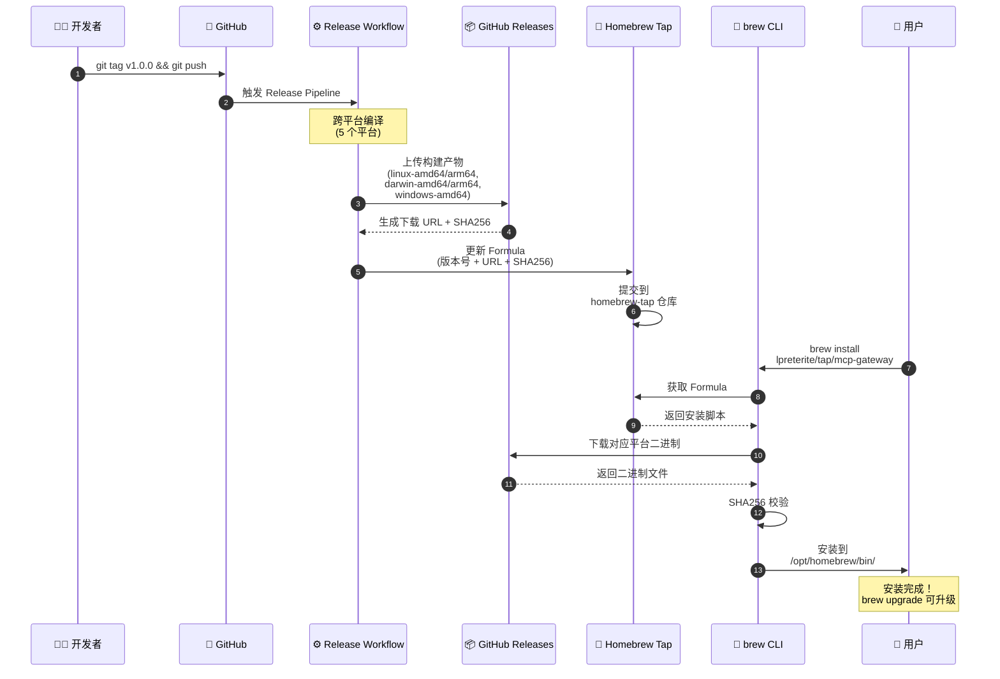

# MCP Gateway 部署说明

本文档面向需要在生产环境或服务器上部署 MCP Gateway 的运维人员，介绍配置管理、部署场景及故障排查。

---

## 部署流程概览

### 从 GitHub 到 Homebrew 安装

项目使用 GitHub Actions 实现自动化构建和发布，用户通过 Homebrew 一键安装。



### 四色建模说明

| 颜色 | 类型 | 说明 |
|------|------|------|
| 🟥 边界对象 | Boundary | 与用户/外部系统交互的接口 |
| 🟦 控制对象 | Control | 协调和执行流程的对象 |
| 🟨 实体对象 | Entity | 持久化的数据和业务实体 |
| 🟩 消息 | Message | 对象间的通信和调用 |

### 快速开始

**发布新版本**：

```bash
git tag v1.0.0 && git push origin v1.0.0
```

**用户安装**：

```bash
brew install lpreterite/tap/mcp-gateway
```

---

## 部署场景

### 场景一：本地开发

适用于在本地机器上进行 MCP Gateway 开发或测试。

```bash
# 1. 初始化配置
mcp-gateway config init

# 2. 编辑配置
vim ~/.config/mcp-gateway/config.json

# 3. 直接运行（实时查看日志）
mcp-gateway --log-level debug

# 4. 新开终端验证
curl http://localhost:4298/health
```

**配置文件示例**（本地开发）：

```json
{
  "gateway": {
    "host": "127.0.0.1",
    "port": 4298,
    "cors": true
  },
  "pool": {
    "minConnections": 1,
    "maxConnections": 3
  },
  "servers": [
    {
      "name": "minimax",
      "type": "local",
      "command": ["uvx", "minimax-coding-plan-mcp"],
      "enabled": true,
      "poolSize": 2
    }
  ]
}
```

---

### 场景二：Homebrew 安装（macOS/Linux）

通过 Homebrew 包管理器安装 mcp-gateway。

#### 安装步骤

```bash
# 1. 添加 Homebrew Tap
brew tap lpreterite/tap

# 2. 安装 mcp-gateway
brew install mcp-gateway

# 3. 验证安装
mcp-gateway --version

# 4. 编辑配置文件
vim /opt/homebrew/etc/mcp-gateway/config.json
```

#### 安装后结构

```
/opt/homebrew/
├── bin/
│   └── mcp-gateway           # 可执行文件
└── etc/
    └── mcp-gateway/
        └── config.json       # 配置文件
```

#### 服务管理

```bash
# 安装系统服务
mcp-gateway service install --config /opt/homebrew/etc/mcp-gateway/config.json

# 启动服务
mcp-gateway service start

# 检查状态
mcp-gateway service status

# 查看日志
mcp-gateway --log-level debug
```

#### 升级

```bash
# 更新 Homebrew
brew update

# 升级 mcp-gateway
brew upgrade mcp-gateway
```

#### 卸载

```bash
brew uninstall mcp-gateway
brew untap lpreterite/tap
```

---

## 本地开发与测试

### 开发环境准备

**前置条件**：

- Go 1.21+
- Git
- Homebrew（macOS）或系统包管理器（Linux）

**克隆代码**：

```bash
git clone https://github.com/lpreterite/mcp-gateway.git
cd mcp-gateway
```

**安装依赖**：

```bash
go mod download
```

### 代码结构

```
mcp-gateway/
├── cmd/
│   └── gateway/              # 主程序入口
├── src/
│   └── gwservice/            # 核心服务包
│       ├── facade.go         # 门面接口
│       ├── facade_darwin.go  # macOS 平台适配
│       ├── facade_linux.go   # Linux 平台适配
│       ├── manager.go        # 服务管理器
│       ├── platform_*.go     # 平台特定实现
│       └── *_test.go         # 测试文件
├── config/
│   └── servers.json          # 示例配置
└── docs/
    └── product/
        └── deployment.md     # 本文档
```

### 运行测试

```bash
# 运行所有测试
go test -race ./...

# 运行单元测试（跳过集成测试）
go test -short -race ./...

# 运行特定包的测试
go test -race ./src/gwservice/...

# 查看测试覆盖率
go test -cover ./...

# 生成覆盖率报告
go test -coverprofile=coverage.out ./...
go tool cover -html=coverage.out -o coverage.html
```

### 本地运行服务

**方式一：直接运行**：

```bash
# 使用默认配置
go run ./cmd/gateway

# 指定配置文件
go run ./cmd/gateway --config ./config/servers.json

# 开启调试日志
go run ./cmd/gateway --log-level debug
```

**方式二：构建后运行**：

```bash
# 构建二进制
go build -o mcp-gateway ./cmd/gateway

# 运行
./mcp-gateway --config ./config/servers.json
```

### 调试服务

**查看服务状态**：

```bash
# 初始化配置（如需要）
./mcp-gateway config init

# 检查配置
./mcp-gateway config info

# 查看服务状态
./mcp-gateway service status
```

**健康检查**：

```bash
# 检查服务健康状态
curl http://localhost:4298/health

# 查看响应示例
{
  "status": "healthy",
  "version": "1.0.0",
  "servers": {
    "minimax": "running"
  },
  "pool": {
    "total": 2,
    "idle": 2
  }
}
```

**实时日志**：

```bash
# 终端 1：启动服务
./mcp-gateway --log-level debug

# 终端 2：发送请求
curl http://localhost:4298/health
```

### 与 OpenCode 集成测试

详见 [OpenCode MCP 集成测试](./opencode-mcp-test.md)。

### CI 本地模拟

在本地运行 CI 测试脚本：

```bash
# 运行 golangci-lint（如已安装）
golangci-lint run --timeout=5m

# 或安装后运行
go install github.com/golangci/golangci-lint/cmd/golangci-lint@latest
golangci-lint run --timeout=5m ./...

# 运行 Go vet
go vet ./...

# 安全扫描
go install github.com/securego/gosec/v2/cmd/gosec@latest
gosec ./...
```

---

## 配置文件格式

### 配置文件结构

```json
{
  "gateway": { ... },
  "pool": { ... },
  "servers": [ ... ],
  "mapping": { ... },
  "toolFilters": { ... }
}
```

### gateway 配置

网关服务器配置。

| 字段 | 类型 | 默认值 | 说明 |
|------|------|--------|------|
| `host` | string | `0.0.0.0` | 监听地址 |
| `port` | number | `4298` | 监听端口 |
| `cors` | boolean | `true` | 是否启用 CORS |

```json
{
  "gateway": {
    "host": "0.0.0.0",
    "port": 4298,
    "cors": true
  }
}
```

### pool 配置

连接池配置，控制 MCP 服务器连接的复用策略。

| 字段 | 类型 | 默认值 | 说明 |
|------|------|--------|------|
| `minConnections` | number | `1` | 每个 server 预启动的最小连接数 |
| `maxConnections` | number | `5` | 每个 server 允许的最大连接数 |
| `acquireTimeout` | number | `10000` | 获取连接超时时间（毫秒） |
| `idleTimeout` | number | `60000` | 空闲连接回收时间（毫秒） |
| `maxRetries` | number | `3` | 连接失败最大重试次数 |

```json
{
  "pool": {
    "minConnections": 1,
    "maxConnections": 5,
    "acquireTimeout": 10000,
    "idleTimeout": 60000,
    "maxRetries": 3
  }
}
```

### servers 配置

MCP 服务器列表，定义需要代理的 MCP 服务。

| 字段 | 类型 | 必需 | 说明 |
|------|------|------|------|
| `name` | string | 是 | 服务器唯一标识名 |
| `type` | string | 是 | 服务器类型：`local` 或 `remote` |
| `command` | string[] | 是（local） | 启动命令 |
| `url` | string | 是（remote） | 远程服务器 URL |
| `enabled` | boolean | 否 | 是否启用（默认 true） |
| `env` | object | 否 | 环境变量 |
| `poolSize` | number | 否 | 此服务器的连接池大小 |

**local 类型示例**：

```json
{
  "servers": [
    {
      "name": "minimax",
      "type": "local",
      "command": ["uvx", "minimax-coding-plan-mcp"],
      "enabled": true,
      "env": {
        "API_KEY": "your-api-key"
      },
      "poolSize": 3
    }
  ]
}
```

**remote 类型示例**：

```json
{
  "servers": [
    {
      "name": "remote-mcp",
      "type": "remote",
      "url": "https://mcp.example.com/sse",
      "enabled": true,
      "poolSize": 2
    }
  ]
}
```

### mapping 配置

工具名称映射规则，控制对外暴露的工具名格式。

| 字段 | 类型 | 说明 |
|------|------|------|
| `prefix` | string | 工具名前缀 |
| `stripPrefix` | boolean | 是否剥离原始前缀 |
| `rename` | object | 工具重命名映射 |

```json
{
  "mapping": {
    "minimax": {
      "prefix": "minimax",
      "stripPrefix": true,
      "rename": {
        "old_name": "new_name"
      }
    }
  }
}
```

### toolFilters 配置

工具过滤规则，控制哪些工具对客户端可见。

```json
{
  "toolFilters": {
    "minimax": {
      "include": ["understand_image", "web_search"],
      "exclude": ["admin_tool"]
    }
  }
}
```

---

## 环境变量

| 环境变量 | 说明 | 优先级 |
|----------|------|--------|
| `MCP_GATEWAY_CONFIG` | 配置文件路径 | 高于默认路径，低于 `--config` |
| `TZ` | 时区设置 | 影响日志时间戳 |

### 示例

```bash
# 使用指定配置文件
export MCP_GATEWAY_CONFIG=/etc/mcp-gateway/config.json
mcp-gateway

# 或在一行内执行
MCP_GATEWAY_CONFIG=/etc/mcp-gateway/config.json mcp-gateway
```

---

## 配置路径优先级

MCP Gateway 按以下顺序查找配置文件：

1. **`--config` 参数**（最高优先级）
   ```bash
   mcp-gateway --config /path/to/config.json
   ```

2. **`MCP_GATEWAY_CONFIG` 环境变量**
   ```bash
   export MCP_GATEWAY_CONFIG=/path/to/config.json
   ```

3. **`~/.config/mcp-gateway/config.json`**（用户目录）
   - macOS: `$HOME/.config/mcp-gateway/config.json`
   - Linux: `$HOME/.config/mcp-gateway/config.json`

4. **`./config/servers.json`**（本地开发）

5. **Homebrew 系统配置**（仅 macOS）
   - `/opt/homebrew/etc/mcp-gateway/config.json`
   - `/usr/local/etc/mcp-gateway/config.json`

6. **`/etc/mcp-gateway/config.json`**（Linux 系统级）

---

## GitHub Actions 发布流程

### 完整流程

1. **开发者** 打 tag 并 push 到 GitHub
2. **GitHub Actions** 自动触发 Release Workflow
3. Workflow 执行：
   - 运行测试
   - 跨平台编译（5 个平台）
   - 创建 GitHub Release
   - 上传构建产物
4. **Homebrew Tap** 仓库自动更新 Formula
5. 用户通过 **brew install** 安装

### 触发发布

```bash
# 打 tag 触发（推荐）
git checkout main
git pull origin main
git tag v1.0.0
git push origin v1.0.0
```

### 构建产物

| OS | Arch | 文件名 |
|----|------|--------|
| Linux | amd64 | mcp-gateway-linux-amd64 |
| Linux | arm64 | mcp-gateway-linux-arm64 |
| macOS | amd64 | mcp-gateway-darwin-amd64 |
| macOS | arm64 | mcp-gateway-darwin-arm64 |
| Windows | amd64 | mcp-gateway-windows-amd64.exe |

### Homebrew Formula 说明

Tap 仓库地址：[github.com/lpreterite/homebrew-tap](https://github.com/lpreterite/homebrew-tap)

Formula 是 Ruby 脚本，告诉 Homebrew：
- 从哪里下载二进制文件
- 如何安装到系统
- 如何生成默认配置

brew 根据用户系统自动选择对应平台的二进制文件。

---

## 安全注意事项

### 网络安全

1. **限制监听地址**
   - 开发环境：`127.0.0.1`（仅本地访问）
   - 生产环境：`0.0.0.0`（需要配合防火墙）

2. **配置防火墙**
   ```bash
   # iptables (Linux)
   sudo iptables -A INPUT -p tcp --dport 4298 -s 192.168.1.0/24 -j ACCEPT
   sudo iptables -A INPUT -p tcp --dport 4298 -j DROP
   ```

3. **启用 HTTPS**
   - 使用 Nginx/Caddy 反向代理

### 配置安全

1. **保护敏感信息**
   - 避免在配置文件中明文存储密钥
   - 使用环境变量代替：

   ```json
   {
     "servers": [
       {
         "name": "minimax",
         "env": {
           "API_KEY": "${MINIMAX_API_KEY}"
         }
       }
     ]
   }
   ```

2. **设置配置文件权限**
   ```bash
   chmod 600 ~/.config/mcp-gateway/config.json
   ```

3. **以非 root 用户运行**
   - Homebrew 默认使用 `appuser`

### 服务安全

1. **定期更新**
   - 使用 `brew upgrade mcp-gateway` 更新 Homebrew 安装

2. **启用日志监控**
   ```bash
   mcp-gateway --log-level debug
   ```

---

## 故障排查

### 常见问题

#### 1. 服务启动失败

**排查步骤**：

```bash
# 1. 检查配置语法
mcp-gateway config info

# 2. 手动运行查看错误
mcp-gateway --config /path/to/config.json --log-level debug

# 3. 检查端口占用
lsof -i :4298
```

#### 2. MCP 服务器连接失败

**排查步骤**：

```bash
# 1. 检查 MCP 服务器命令是否可用
which uvx

# 2. 手动测试启动命令
uvx minimax-coding-plan-mcp --help

# 3. 查看详细日志
mcp-gateway --log-level debug
```

#### 3. 工具调用返回 503

**排查步骤**：

```bash
# 1. 检查健康状态
curl http://localhost:4298/health

# 2. 等待连接池初始化（10-30 秒）

# 3. 增加连接池大小
```

### 服务状态诊断

```bash
mcp-gateway service status
```

---

## 参考链接

- [GitHub 仓库](https://github.com/lpreterite/mcp-gateway)
- [Homebrew Tap](https://github.com/lpreterite/homebrew-tap)
- [安装指南](./installation.md)
- [配置示例](../config/servers.example.json)
